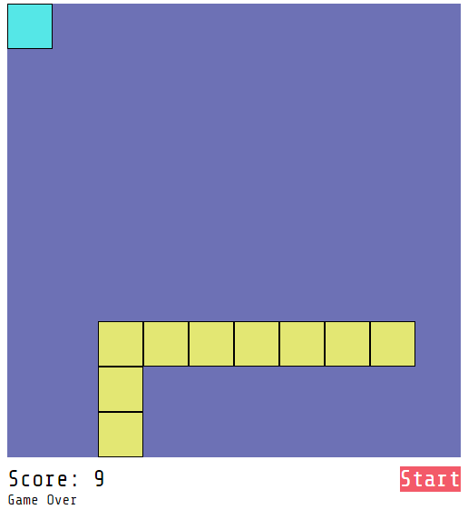
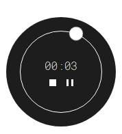
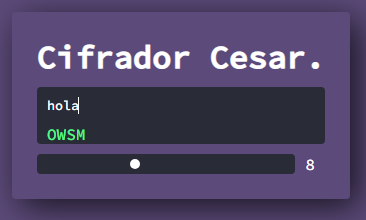
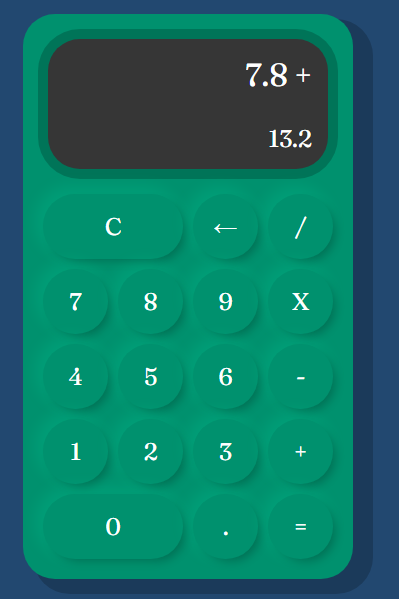
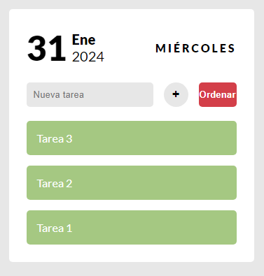
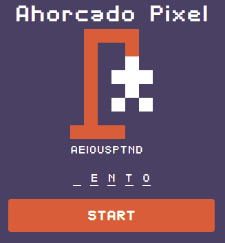
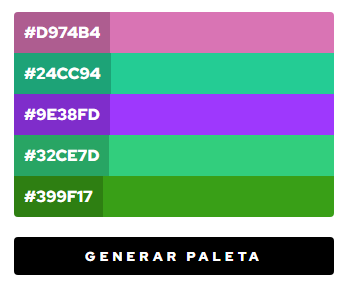

# 7 juegos en Html, css y javascript
Este repositorio contiene siete juegos hechos en html, css y javascript:
1. Juego snake.     
2. Cronómetro.      
2. Cifrador César.     
4. Calculadora.     
5. Lista de tareas.     
6. Juego del ahorcado.     
7. Generador de paleta de colores.     
